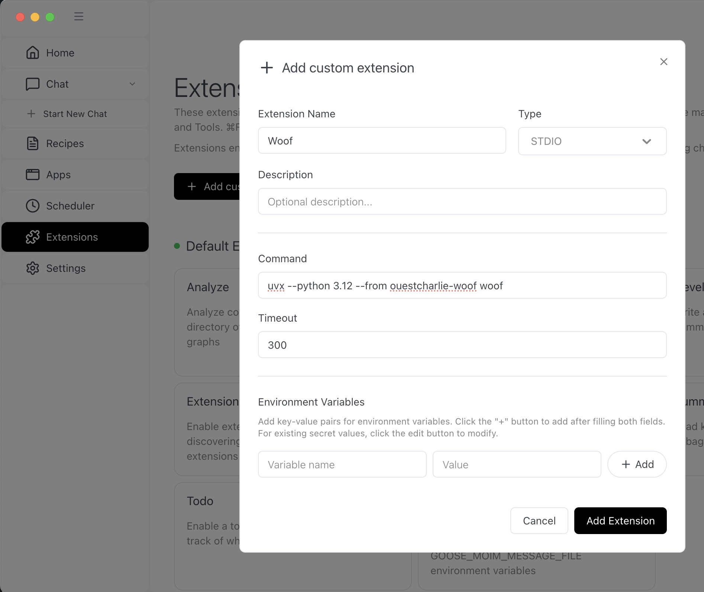
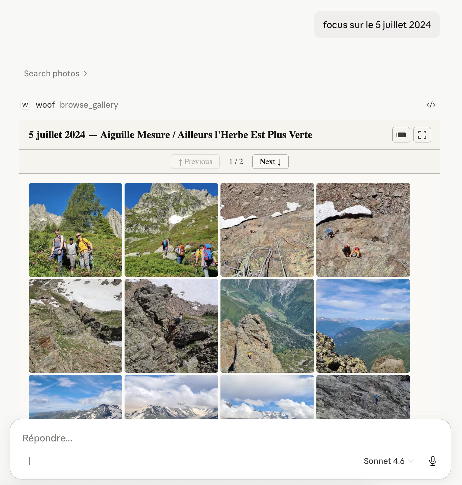

<p align="center"></p>

# Woof — See your Photo Gallery in your AI assistant

[](#status)

[](#status) [](#status) [](#status)

[](https://modelcontextprotocol.io/) [](https://github.com/astral-sh/uv)

mcp-name: io.github.ouestcharlie/ouestcharlie-woof

Woof is the photo and video gallery companion to your **your AI assistant** (Claude Desktop, Goose...). It complements those powerful tools with a searchable **gallery**. Your photos and videos remain exactly where they are — on your own drives (local or mounted).

No cloud subscription. No proprietary lock-in. Your library, your way.

Woof is the **MCP App** frontend to **"Où est Charlie ?"**  ("Where is Wally?" in French), a full AI native framework to manage your photos and videos.

## What makes it different

Most photo managers lock your library into a cloud service (Google Photos, iCloud) or require a database server that becomes a single point of failure. Woof takes a different approach:

- **Conversation as your gallery.** Woof connects to your AI assistant (Claude Desktop, ChatGPT, Goose…) and turns it into a full photo browser. Ask in plain language, get results inline. No separate app to learn.
- **Privacy by design.** Only metadata travels to your AI assistant — your actual photos are served locally by Woof. Your pictures are never uploaded to any AI service unless you explicitly ask.
- **No database lock-in.** Metadata lives as XMP sidecar files right next to your photos, plus lightweight JSON manifests. Move a drive, copy a folder — your entire organization travels with your photos.
- **Open formats, forever.** XMP is an ISO standard. JSON is universal. AVIF is royalty-free. Every tool you already use — Lightroom, darktable, ExifTool — can read your metadata today and long after OuEstCharlie is gone.
- **Your photos are never touched.** Woof reads your library as-is. It never modifies, moves, or deletes your original files. It also honors existing XMP metadata from Lightroom, darktable, or any other tool — rather than overwriting it.
- **Works with your existing folder structure.** Just point Woof at your photos folder. No migration, no reorganization required.

> **More about OuEstCharlie and Woof on the [OuEstCharlie Blog](https://ouestcharlie.github.io/ouestcharlie/)**

---

## Installation

Woof runs as a local [MCP](https://modelcontextprotocol.io/) server. It connects to your AI desktop client (Claude Desktop, Goose...) and exposes your photo library as a set of tools.


### Option A — Bundle install (recommended but Claude Desktop only)

#### Connect to Claude Desktop

Download the latest `ouestcharlie-woof.mcpb` from the [Releases](https://github.com/ouestcharlie/ouestcharlie-woof/releases) page and double-click it. Claude Desktop will prompt you to install Woof in one click — no configuration file to edit.

##### See also in Woof Blog:

>  **[Step by Step install of OuEstCharlie Woof in Claude Desktop](https://ouestcharlie.github.io/ouestcharlie/2026/05/13/claude-how-to-step-by-step/)** 

### Option B — Manual `uvx` configuration

#### Prerequisites

Python packages of OuEstCharlie Woof are managed by [`uv`](https://docs.astral.sh/uv/getting-started/installation/) and the command `uvx`. uv might be already available on your system.

System prerequisites (all install options):
- **macOS**: `brew install inih brotli gettext` (required by pyexiv2 at runtime)
- **Linux/Windows**: no extra steps


#### Connect to Claude Desktop

> **Reference:** [Getting Started with Local MCP Servers on Claude Desktop](https://support.claude.com/en/articles/10949351-getting-started-with-local-mcp-servers-on-claude-desktop)

Open (or create) `~/Library/Application Support/Claude/claude_desktop_config.json` and add or update `mcpServers`:

```json
{
  "mcpServers": {
    "woof": {
      "command": "uvx",
      "args": ["--python", "3.13", "--from", "ouestcharlie-woof", "woof-bridge"]
    }
  }
}
```

Restart Claude Desktop. Woof will appear as an MCP integration, and the gallery will render as an interactive panel inside your conversation.

#### Connect to ChatGPT Desktop

**NOTE: As of May 2026, ChatGPT is no longer supporting local MCP servers. Following is not longer available!**


#### Connect to Goose

> **Reference:** [Goose MCP extensions documentation](https://goose-docs.ai/docs/getting-started/using-extensions/#mcp-servers)

[Goose](https://github.com/block/goose) supports MCP servers via its extension system. 

Either add through the user interface as a Custom Extension:
<p align="center"></p>
<p align="center"><i>Setup Woof extension in Goose</i></p>

Or add the following to your Goose configuration (`~/.config/goose/config.yaml`):

```yaml
extensions:
  woof:
    type: stdio
    cmd: uvx
    args: ["--python", "3.13", "--from", "ouestcharlie-woof", "woof-bridge"]
    enabled: true
```


#### Other supported AI Assistants

Other clients support MCP Apps, for example VSCode Github Copilot or Codex.

See the [MCP Extension Support Matrix](https://modelcontextprotocol.io/extensions/client-matrix)

---

## First Steps

### 1. Register your photos folder

Once Woof is connected to your AI client, ask it to register your photo folder:

> *"Add a local library to Woof pointing to /Users/yourname/Pictures"*

Woof supports any folder on a local drive — including folders synced from iCloud Drive, OneDrive, or Google Drive, as long as the files are locally available.

### 2. Index your library

Trigger the indexer to scan your photos and build the metadata index:

> *"Index my local library"*

Woof will launch the indexing agent, which will:
- Read EXIF/XMP metadata from each photo
- Write XMP sidecar files alongside your originals (never modifying the originals)
- Generate thumbnails and previews
- Build a fast index for querying

Indexing speed is roughly 10 to 100 seconds per 1,000 photos depending on format and hardware.

### 3. Start browsing

Once indexing is complete, just ask:

> *"Show me photos in Woof from last July"*

> *"In Woof, show me pictures taken near Paris"*

> *"Search Woof for photos with 'Tour Eiffel' in the description"*

> *"How many photos do I have in Woof?"*

The gallery panel will appear inline in your conversation with matching results.

<p align="center"></p>
<p align="center"><i>Ouestcharlie Woof photo gallery inside Claude Desktop</i></p>

## More tutorials

- [Create your personal photo gallery with Claude, Strava and OuEstCharlie Woof](https://ouestcharlie.github.io/ouestcharlie/2026/07/31/personal-photo-gallery-Claude-Strava-OuEstCharly-Woof/)

---

## Storage

Woof supports **local filesystem** and **cloud_mount** libraries on macOS, Linux, and Windows:
- **filsystem** for a standard local hard drive or SSD, including local network drive (e.g. NAS)
- **clound_mount** for a folder synced from iCloud Drive, OneDrive, Google Drive, or Infomaniak kDrive — as long as files are downloaded and locally accessible

Native cloud storage (S3, Azure, GCS, OneDrive API) is planned.

---

## Status

Woof is an **early preview**. It works well today for browsing and searching a local photo library.

### Current features

| Feature | Notes |
|---|---|
| Local filesystem indexing (macOS, Linux, Windows) |  |
| Mounted cloud drives (iCloud Drive, OneDrive, kDrive) | Files must be locally synced |
| Photos (JPEG, PNG, TIFF, HEIC, RAW) | HEIC and RAW depend on the build options |
| Video support (MOV, MP4) ||
| Search description, tags, rating, date, partition | full text search on description |
| Search photo features (date, dimensions, GPS bounding box) |  |
| Search video features (duration, dimensions, GPS bounding box) |  |
| Search camera features (make, model, aperture, lens) | | 
| Sort ascending or descending on any field |  |
| Gallery view (Claude Desktop or Goose) as grid or preview | Photo details on preview |
| Change detection / automatic re-indexing | Partial — added and removed pictures |

### Planned features

| Feature |
|---|
| Albums and smart filters |
| Share pictures with host (Claude Desktop, ChatGPT, Goose…) |
| Enrichment agents (faces, scene recognition) |
| Mobile companion app |
| Native cloud libraries (S3, OneDrive, GCS…) |

**What this means for you**: if you hit a bug or unexpected behavior, please [open an issue](https://github.com/ouestcharlie/ouestcharlie-woof/issues).

---

## Privacy Policy

Woof is designed with privacy as a core principle.

- **Data collected**: Only photo metadata (EXIF, GPS coordinates, camera make/model, dates, file paths) is read and indexed. No account or personal information is collected.
- **Data storage**: All metadata is stored locally on your own device as XMP sidecar files and JSON manifests alongside your photos. No data is stored on any remote server.
- **AI assistant**: Only metadata and thumbnail images are sent to your AI assistant (Claude, ChatGPT, Goose…) when you perform a search. Your original photo files are never uploaded to any AI service unless you explicitly share them.
- **Third parties**: No metadata or usage data is shared with any third party.
- **Retention**: All data remains under your full control. Deleting the XMP sidecars and `.ouestcharlie/` folders from your photo library completely removes all Woof metadata.

For privacy questions, please [open an issue](https://github.com/ouestcharlie/ouestcharlie-woof/issues).

---

## Support

**Bug reports and feature requests**: [GitHub Issues](https://github.com/ouestcharlie/ouestcharlie-woof/issues)

---

## Developers' corner

For developer and architecture documentation, see [README_DEV.md](README_DEV.md).

---

## License

[MIT license](LICENCE)
