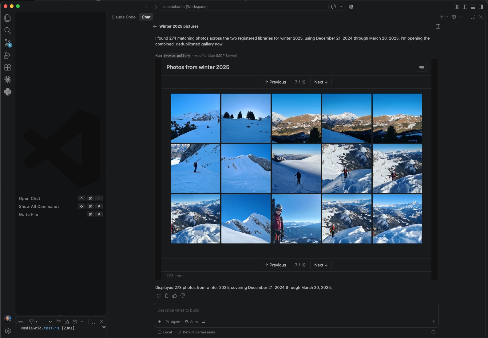

# Woof — See your Photo Gallery in your AI assistant

  

 

mcp-name: io.github.ouestcharlie/ouestcharlie-woof

Woof is the photo and video gallery companion to your **your AI assistant** (Claude Desktop, Goose, VS Code / GitHub Copilot...). It complements those powerful tools with a searchable **gallery**. Your photos and videos remain exactly where they are — on your own drives (local or mounted).

No cloud subscription. No proprietary lock-in. Your library, your way.

Woof is the **MCP App** frontend to **"Où est Charlie ?"**  ("Where is Wally?" in French), a full AI native framework to manage your photos and videos.

## What makes it different

Most photo managers lock your library into a cloud service (Google Photos, iCloud) or require a database server that becomes a single point of failure. Woof takes a different approach:

- **Conversation as your gallery.** Woof connects to your AI assistant (Claude Desktop, Goose, VS Code / GitHub Copilot…) and turns it into a full photo browser. Ask in plain language, get results inline. No separate app to learn.
- **Privacy by design.** Only metadata travels to your AI assistant — your actual photos are served locally by Woof. Your pictures are never uploaded to any AI service unless you explicitly ask.
- **No database lock-in.** Metadata lives as XMP sidecar files right next to your photos, plus lightweight JSON manifests. Move a drive, copy a folder — your entire organization travels with your photos.
- **Open formats, forever.** XMP is an ISO standard. JSON is universal. AVIF is royalty-free. Every tool you already use — Lightroom, darktable, ExifTool — can read your metadata today and long after OuEstCharlie is gone.
- **Your photos are never touched.** Woof reads your library as-is. It never modifies, moves, or deletes your original files. It also honors existing XMP metadata from Lightroom, darktable, or any other tool — rather than overwriting it.
- **Works with your existing folder structure.** Just point Woof at your photos folder. No migration, no reorganization required.

> **More about OuEstCharlie and Woof on the [OuEstCharlie Blog](https://ouestcharlie.github.io)**

---

## Installation and first steps

> **See [OuEstCharlie Woof install and first steps](https://ouestcharlie.github.io/2026/04/01/ouestcharlie-woof-install-first-steps/)**

---

## Status

Woof is an **early preview**. It works well today for browsing and searching a local photo library.

### Current features

| Feature | Notes |
|---|---|
| Compatible with Claude Desktop, Goose, VS Code| Any desktop application with MCP App support|
| Available on Macos, Windows, Linux| Python packages are built and released in Pypi|
| Local filesystem indexing | Files must be locally synced |
| Photos (JPEG, PNG, TIFF, HEIC, RAW) | HEIC and RAW depend on the build options |
| Video support (MOV, MP4) ||
| Gallery view as grid or preview | Photo details on preview |
| Image thumbnails and previews | Optimized for display |
| Search description, tags, rating, date, partition | full text search on description |
| Search photo features (date, dimensions, GPS bounding box) |  |
| Search video features (duration, dimensions, GPS bounding box) |  |
| Search camera features (make, model, aperture, lens) | | 
| Sort ascending or descending on any field |  |
| Change detection / automatic re-indexing | Partial — added and removed pictures |

### Planned features

| Feature |
|---|
| Albums and smart filters |
| Share pictures with host (Claude Desktop, ChatGPT, Goose…) |
| Enrichment agents (faces, scene recognition) |
| Mobile companion app |
| Native cloud libraries (S3, OneDrive, GCS…) |

If you hit a bug or unexpected behavior, please [open an issue](https://github.com/ouestcharlie/ouestcharlie-woof/issues).

<i>Ouestcharlie Woof photo gallery inside VSCode, an alternative to Claude CoWork for techies</i>

---

## Privacy Policy

Woof is designed with privacy as a core principle.

- **Data collected**: Only photo metadata (EXIF, GPS coordinates, camera make/model, dates, file paths) is read and indexed. No account or personal information is collected.
- **Data storage**: All metadata is stored locally on your own device as XMP sidecar files and JSON manifests alongside your photos. No data is stored on any remote server.
- **AI assistant**: Only metadata and thumbnail images are sent to your AI assistant (Claude, ChatGPT, Goose…) when you perform a search. Your original photo files are never uploaded to any AI service unless you explicitly share them.
- **Third parties**: No metadata or usage data is shared with any third party.
- **Retention**: All data remains under your full control. Deleting the XMP sidecars and `.ouestcharlie/` folders from your photo library completely removes all Woof metadata.

For privacy questions, please [open an issue](https://github.com/ouestcharlie/ouestcharlie-woof/issues).

---

## Support

**Bug reports and feature requests**: [GitHub Issues](https://github.com/ouestcharlie/ouestcharlie-woof/issues)

---

## Developers' corner

For developer and architecture documentation, see [README_DEV.md](README_DEV.md).

### Contributing

See the [Contributing section in OuEstCharlie](https://github.com/ouestcharlie/ouestcharlie#contributing)

---

## License

[MIT license](LICENCE)
